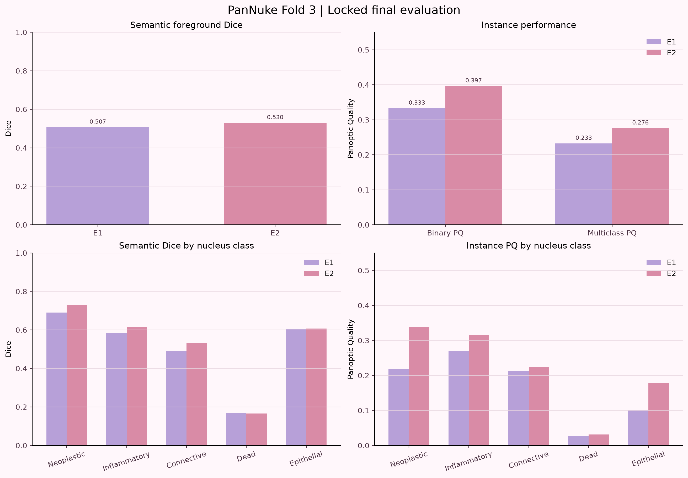
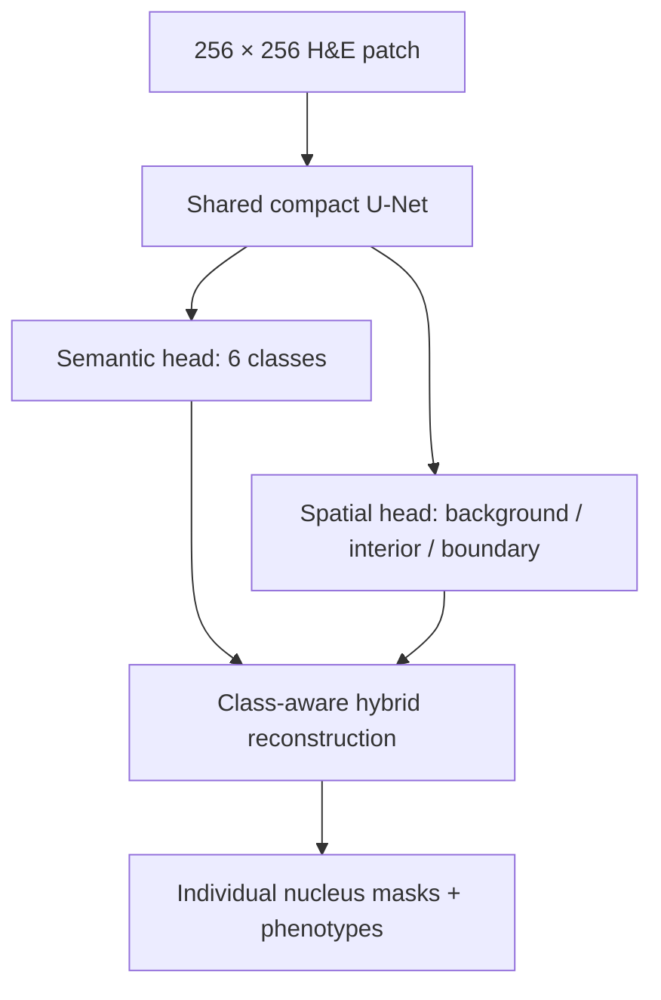
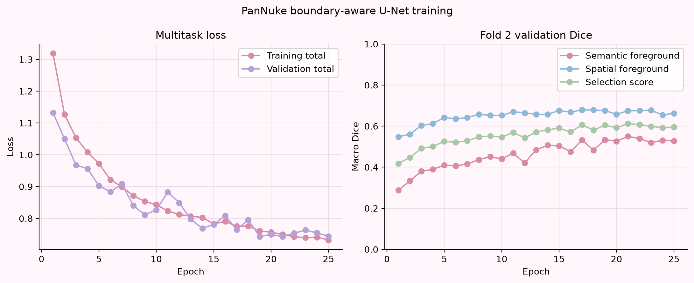
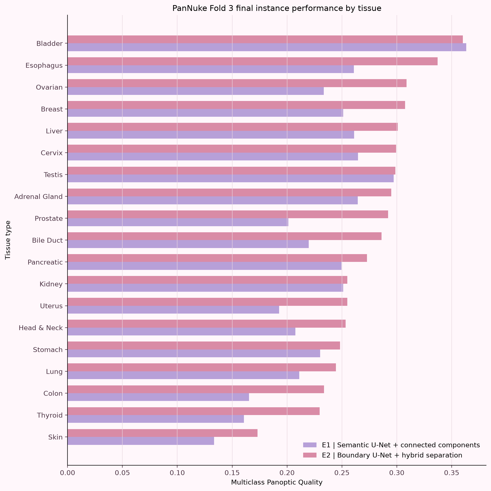
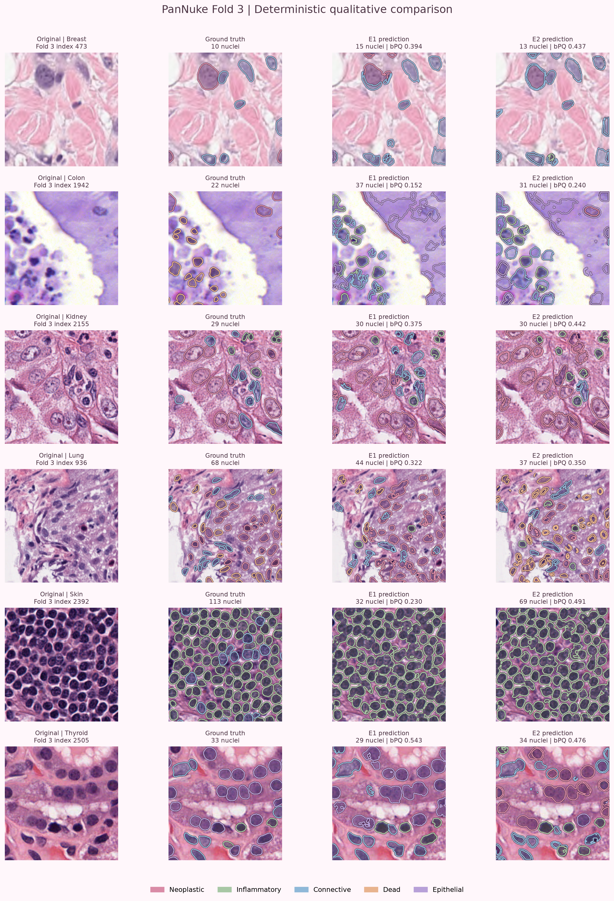

# Pan-Cancer Nuclei Segmentation

**A reproducible comparison of semantic and boundary-aware U-Net pipelines for nucleus instance segmentation and phenotyping across heterogeneous H&E tissues**

[](https://github.com/rane-mahfoud/pancancer-nuclei-dashboard/actions/workflows/ci.yml)
[](https://pancancer-nuclei-dashboard-jccnachhkf9txw6jd7tfuk.streamlit.app/)
[](pyproject.toml)
[](tests)
[](LICENSE)

> **Completed research demonstration.** Model and post-processing decisions were made on PanNuke Folds 1–2, then evaluated once on the locked Fold 3 test set. This repository is not a clinical diagnostic system.



## Final result

On all **2,722 locked Fold 3 patches**, the boundary-aware E2 pipeline outperformed the semantic E1 baseline at both the pixel and instance levels.

| Locked Fold 3 metric | E1 baseline | E2 boundary-aware hybrid | Absolute gain | Relative gain |
| --- | ---: | ---: | ---: | ---: |
| Semantic foreground Dice | 0.5069 | **0.5300** | +0.0231 | +4.6% |
| Binary Panoptic Quality (bPQ) | 0.3332 | **0.3966** | +0.0634 | **+19.0%** |
| Multiclass Panoptic Quality (mPQ) | 0.2326 | **0.2764** | +0.0438 | **+18.8%** |

E2 also produced:

- **9,640 more matched nuclei**;
- **477 fewer extra predictions**;
- **9,640 fewer missed nuclei**.

The instance-level gain is much larger than the semantic-Dice gain. That is the intended result: E2 was designed primarily to separate touching nuclei, not merely to recolor pixels.

## Research question

Semantic segmentation can correctly label nucleus pixels while still merging adjacent nuclei into one connected region. That distinction matters when the downstream goal is to count cells, assign a phenotype to each cell, or measure tissue composition.

This study asks:

> Does explicitly teaching a compact U-Net to predict nucleus interiors and boundaries improve individual-nucleus recovery and phenotype-aware panoptic quality across diverse PanNuke tissues?

The comparison is deliberately controlled. E1 and E2 use the same compact U-Net backbone, data split, augmentation framework, training budget, and evaluation code. The central intervention is the additional spatial task and its corresponding instance-reconstruction method.

## Dataset and experimental protocol

The project uses [PanNuke](https://warwick.ac.uk/fac/cross_fac/tia/data/pannuke), a pan-cancer H&E dataset containing 256 × 256 RGB patches, individual nucleus masks, five positive nucleus categories, and 19 tissue types.

| Fold | Role in this project | Number of patches | What it was allowed to influence |
| --- | --- | ---: | --- |
| Fold 1 | Training | 2,656 | Model fitting, pixel audits, and class weights |
| Fold 2 | Validation/development | 2,523 | Checkpoint selection, area thresholds, watershed parameters, and failure diagnosis |
| Fold 3 | Locked final test | 2,722 | One final comparison after every decision was frozen |

This is a fixed train/validation/test assignment using the three supplied PanNuke folds. It is **not** described as three-fold cross-validation because the fold roles were not rotated and averaged.

The exact Hugging Face dataset revision is pinned to:

```text
1f498f7bd6a85ef5f204c592b41ac881eab61005
```

Raw images and masks are not committed to Git. See [`docs/DATASET_SETUP.md`](docs/DATASET_SETUP.md) for setup and licensing notes.

### Nucleus categories

The model predicts background plus five positive PanNuke categories:

1. neoplastic;
2. inflammatory;
3. connective/soft tissue;
4. dead;
5. non-neoplastic epithelial.

Pixels claimed by multiple reference instance masks have ambiguous ownership. They receive label `255` and are excluded from the supervised loss and semantic measurements instead of being assigned an arbitrary class.

## The two systems

| Component | E1: semantic baseline | E2: boundary-aware hybrid |
| --- | --- | --- |
| Backbone | Compact U-Net | The same compact U-Net |
| Semantic output | 6 logits per pixel | 6 logits per pixel |
| Additional spatial output | None | 3 logits: background, nucleus interior, boundary |
| Instance reconstruction | Per-class connected components | Watershed for four classes; connected components for inflammatory nuclei |
| Main purpose | Establish a transparent baseline | Test whether explicit separation cues improve instance recovery |



### E1: semantic U-Net plus connected components

E1 predicts one semantic class at every pixel. During post-processing, each positive class is processed separately with 8-connected-component labeling. Components smaller than a Fold 2-selected minimum area are discarded, and every retained component receives a unique instance ID.

This baseline is fast, deterministic, and easy to audit. Its structural weakness is equally clear: touching nuclei of the same predicted class form one connected component and therefore cannot be separated.

The selected E1 minimum instance area was **100 pixels**.

### E2: shared semantic and spatial learning

E2 reuses the entire E1 encoder, bottleneck, decoder, and skip connections. At the final full-resolution feature map, it attaches two independent 1 × 1 classifiers:

- a semantic classifier with six output channels;
- a spatial classifier with three output channels.

The full E2 model has **7,763,305 trainable parameters**. A GPU forward/backward smoke test ran successfully on an NVIDIA GeForce RTX 3050 Laptop GPU with approximately **0.210 GiB** peak allocated memory for the checked batch.

## Boundary targets

The spatial supervision uses four possible target values:

| Value | Spatial label | Meaning |
| ---: | --- | --- |
| 0 | Background | Pixel outside every unambiguous nucleus |
| 1 | Interior | Nucleus pixel outside its derived inner border |
| 2 | Boundary | Two-pixel inner contour derived from an individual instance mask |
| 255 | Ignore | Ambiguous overlap claimed by multiple reference instances |

Boundaries are derived **from each nucleus separately**, not from the union of all foreground masks. This preserves a separation signal where two objects touch; creating a contour only after unioning the masks could erase their internal contact line.

The Fold 1 target audit covered 63,218 nuclei:

| Spatial class | Pixels | Share | Logarithmic class weight |
| --- | ---: | ---: | ---: |
| Background | 144,404,042 | 82.961% | 0.2173 |
| Interior | 18,558,272 | 10.662% | 1.1211 |
| Boundary | 11,100,086 | 6.377% | 1.6615 |

Only 1,216 overlap pixels were ignored.

## Loss and training

Each task combines weighted cross-entropy with foreground multiclass Dice:

```text
task_loss = 0.5 × weighted_cross_entropy + 0.5 × foreground_dice_loss
total_loss = 1.0 × semantic_loss + 0.5 × spatial_loss
```

Cross-entropy supplies local class-discrimination gradients and supports class weighting. Dice directly rewards regional overlap and is less dominated by the large background class. Background is excluded from the Dice term, and only foreground classes present in a batch contribute to its mean.

### E2 training configuration

| Setting | Value |
| --- | --- |
| Epochs | 25 |
| Batch size | 4 |
| Base channels | 32 |
| Optimizer | AdamW |
| Learning rate | 3 × 10⁻⁴ |
| Weight decay | 1 × 10⁻⁴ |
| Scheduler | ReduceLROnPlateau, factor 0.5, patience 3 |
| Mixed precision | CUDA AMP |
| Random seed | 42 |
| Semantic task weight | 1.0 |
| Spatial task weight | 0.5 |

The best E2 checkpoint occurred at epoch 21. Its Fold 2 checkpoint-selection score was 0.6125, with semantic foreground Dice 0.5502 and spatial foreground Dice 0.6747. The selection score is the mean of the two head-level Dice measurements; final instance PQ is evaluated separately after post-processing.



## From spatial probabilities to individual nuclei

For neoplastic, connective, dead, and epithelial nuclei, E2 uses marker-controlled watershed:

1. Semantic labels define eligible foreground.
2. High-confidence interior pixels define seed candidates.
3. Small seed regions are removed.
4. A valid foreground component left without a seed receives a fallback marker at its maximum-interior-probability pixel.
5. The elevation image is built from high boundary probability and low interior probability:

   ```text
   elevation = boundary_probability + 0.25 × (1 - interior_probability)
   ```

6. Watershed grows each marker through low-cost regions until high-cost ridges separate neighboring objects.
7. Small final instances are removed.
8. Each retained region receives the majority semantic label among its pixels.

The predefined Fold 2 search evaluated 30 combinations:

- seed threshold: `0.20`, `0.275`, `0.35`, `0.425`, `0.50`;
- minimum seed area: `10`, `20`, `40` pixels;
- minimum final instance area: `100`, `150` pixels.

The frozen configuration was:

```yaml
seed_threshold: 0.35
minimum_seed_area: 20
minimum_instance_area: 100
```

## The most important failure analysis

An early global-watershed version reduced inflammatory-nucleus PQ from approximately 0.284 for E1 to 0.238 for E2. Instead of hiding the regression or tuning against Fold 3, the project ran a controlled three-way diagnostic on Fold 2.

| Fold 2 inflammatory method | Mean sample PQ | Matched | Extra | Missed | Interpretation |
| --- | ---: | ---: | ---: | ---: | --- |
| E1 semantic + connected components | 0.2836 | 3,447 | 4,075 | 7,184 | Baseline |
| E2 semantic + connected components | **0.3304** | **4,091** | 3,171 | **6,540** | E2 semantic prediction was genuinely better |
| E2 semantic + global watershed | 0.2377 | 3,766 | **2,949** | 6,865 | Watershed erased the semantic gain |

The model had not learned worse inflammatory semantics; the post-processing step was the failure point. The final Fold 2-frozen hybrid therefore uses:

- **connected components for inflammatory nuclei**;
- **boundary-aware watershed for neoplastic, connective, dead, and epithelial nuclei**.

This is a validation-selected class rule, not a test-set correction. Fold 3 remained untouched until the rule and all numerical parameters were fixed.

## Fold 2 development result

| Metric | E1 | E2 hybrid | Change |
| --- | ---: | ---: | ---: |
| bPQ | 0.3280 | **0.3865** | +17.8% |
| mPQ | 0.2276 | **0.2674** | +17.5% |
| Matched nuclei | 22,620 | **30,190** | +7,570 |
| Extra predictions | 23,909 | **23,426** | −483 |
| Missed nuclei | 37,252 | **29,682** | −7,570 |

Four of five class-specific PQ values improved on Fold 2. Dead-nucleus PQ fell slightly and remained very low, which was reported rather than followed by another class-specific adjustment.

## What the locked result does—and does not—show

The Fold 3 result supports the project’s central hypothesis: explicit spatial supervision and class-aware reconstruction improve instance recovery under this fixed PanNuke protocol. All five nucleus classes improved in instance PQ on Fold 3, and nearly every tissue improved; Bladder showed a small decline.



It does **not** establish that:

- the method is state of the art;
- the system is clinically validated;
- performance generalizes across hospitals, scanners, stains, or patient populations;
- the predicted nucleus count is accurate enough for a biomarker;
- the reported point estimates have patient-level confidence intervals.

Absolute performance remains moderate, many reference nuclei are still missed, and dead-nucleus performance is especially weak. The project demonstrates a reproducible improvement over a controlled baseline, not a solved nucleus-segmentation problem.

## Why better PQ can coexist with a worse count

PQ is not count accuracy. It rewards one-to-one qualifying matches and their mask overlap while penalizing unmatched predictions and unmatched reference nuclei.

For the deterministic Lung example, the reference contains 68 nuclei. E1 predicts 44 with bPQ 0.322; E2 predicts only 37 with bPQ 0.350. E2 can score slightly higher because its smaller set contains enough better-matched masks relative to the PQ denominator. Both systems still undercount badly. This example is intentionally retained to show why count error must be evaluated separately before any cell-composition claim.

## Deterministic qualitative examples

Six tissue types were declared in advance, and one Fold 3 patch from each was selected with fixed seed `20260906`, independently of model performance. The panel therefore includes clear gains, moderate gains, difficult failures, and a genuine E1 win rather than only attractive successes.



The corresponding machine-readable selection is stored in [`reports/fold3_qualitative_examples.json`](reports/fold3_qualitative_examples.json).

## Interactive results dashboard

The Streamlit dashboard reads the committed locked-result reports and qualitative evidence. It does not need the raw PanNuke dataset, model checkpoints, or a GPU, and it does not accept arbitrary patient images.

### [Open the live Pan-Cancer Nuclei Dashboard](https://pancancer-nuclei-dashboard-jccnachhkf9txw6jd7tfuk.streamlit.app/)

The hosted dashboard opens directly in a web browser—no installation or command line is required. If Streamlit has put the community-hosted app to sleep after a period of inactivity, allow it a moment to wake up.

To run the same dashboard locally instead:

```bash
python -m streamlit run app/streamlit_app.py
```

The app provides:

- the E1-versus-E2 headline comparison;
- tissue-level and class-level views;
- matched, extra, and missed instance counts;
- deterministic qualitative examples;
- plain-language method and limitation notes;
- downloadable comparison tables.

## Quick start

### 1. Clone and create an environment

```bash
git clone https://github.com/rane-mahfoud/pancancer-nuclei-dashboard.git
cd pancancer-nuclei-dashboard
python -m venv .venv
```

Activate it on Windows:

```powershell
.venv\Scripts\activate
```

Or on macOS/Linux:

```bash
source .venv/bin/activate
```

### 2. Install the project

```bash
python -m pip install --upgrade pip
python -m pip install -e ".[dev,data-mirror]"
```

A Hugging Face token is optional for public access, but setting `HF_TOKEN` avoids unauthenticated rate-limit warnings and can improve download reliability.

### 3. Verify the repository

```bash
python -m ruff check src tests scripts
python -m pytest -q
```

Expected tested status at completion:

```text
73 passed
```

### 4. Run a lightweight GPU integration check

```bash
python scripts/check_boundary_unet_gpu.py
```

### 5. Run smoke training

```bash
python scripts/train_semantic_unet.py --smoke-test
python scripts/train_boundary_unet.py --smoke-test
```

## Reproducing the study sequence

The order matters scientifically:


Development and selection commands include:

```bash
python scripts/tune_instance_postprocessing.py
python scripts/tune_watershed_postprocessing.py
python scripts/diagnose_inflammatory_regression.py
python scripts/compare_instance_methods.py
```

The final evaluator verifies the locked Fold 2 settings before processing Fold 3:

```bash
python scripts/evaluate_fold3_final.py --batch-size 4
python scripts/visualize_fold3_final_examples.py
```

Do not rerun threshold selection or invent new class-specific rules after inspecting Fold 3. That would convert the final test set into development data.

## Repository structure

```text
.
├── .github/workflows/           # Linux continuous integration
├── app/                         # Streamlit results dashboard
├── configs/                     # Versioned experiment settings
├── data/                        # Ignored dataset/cache locations
├── docs/                        # Protocol and evaluation documentation
├── models/checkpoints/          # Local best/last weights; not committed
├── reports/                     # Compact JSON evidence and figures
├── scripts/                     # Training, tuning, diagnosis, and evaluation CLIs
├── src/pancancer_nuclei/        # Reusable data/model/training/evaluation code
└── tests/                       # Unit and integration tests
```

Important entry points:

| File | Responsibility |
| --- | --- |
| `src/pancancer_nuclei/data/pannuke.py` | Validate and convert PanNuke samples |
| `src/pancancer_nuclei/data/targets.py` | Derive background/interior/boundary targets |
| `src/pancancer_nuclei/models/unet.py` | Compact E1 U-Net backbone |
| `src/pancancer_nuclei/models/boundary_unet.py` | Shared backbone with semantic and spatial heads |
| `src/pancancer_nuclei/models/losses.py` | Class weighting and CE–Dice segmentation loss |
| `src/pancancer_nuclei/models/boundary_loss.py` | Weighted two-task E2 objective |
| `src/pancancer_nuclei/postprocessing/connected_components.py` | E1 instance reconstruction |
| `src/pancancer_nuclei/postprocessing/watershed.py` | Class-aware hybrid reconstruction |
| `src/pancancer_nuclei/evaluation/panoptic.py` | One-to-one matching, DQ, SQ, bPQ, and mPQ |
| `scripts/evaluate_fold3_final.py` | Locked final evaluator |
| `app/streamlit_app.py` | Read-only evidence dashboard |

## Engineering and reproducibility

- Dataset revision, random seeds, configurations, checkpoints, and reports are explicit.
- Best and resumable `last` checkpoints preserve optimizer, scheduler, mixed-precision, history, and random-generator state.
- Resume behavior was tested with a one-epoch run followed by `--resume` continuation.
- Semantic, spatial, loss, post-processing, panoptic-metric, locked-evaluation, qualitative-selection, and dashboard behavior have regression tests.
- GitHub Actions installs `.[dev,data-mirror]`, runs Ruff, and executes tests with `python -m pytest -q` on a clean Linux runner.
- Raw data, large prediction arrays, Hugging Face caches, and model checkpoints remain outside Git.

## Limitations and next experiments

The strongest next steps are:

1. Add per-patch and per-class count MAE, normalized MAE, signed bias, and agreement plots.
2. Add paired patch bootstrap confidence intervals with a fixed resampling seed.
3. Repeat E1 and E2 training across several initialization seeds.
4. Rotate the PanNuke fold roles and report mean ± standard deviation.
5. Stratify performance by ground-truth nucleus density.
6. Reproduce a stronger modern instance-segmentation baseline under the same data and metrics.
7. Evaluate an external dataset or institution with documented stain/scanner shift.

## References

- Gamper, J. et al. *PanNuke: An Open Pan-Cancer Histology Dataset for Nuclei Instance Segmentation and Classification* (2019).
- Gamper, J. et al. *PanNuke Dataset Extension, Insights and Baselines* (2020), arXiv:2003.10778.
- Graham, S. et al. *HoVer-Net: Simultaneous Segmentation and Classification of Nuclei in Multi-Tissue Histology Images* (2019).

## Author

**Rane Mahfoud**  
Biomedical imaging researcher with an MSc in Biotechnical Medical Systems and Technologies. Prior work includes breast-cancer cell-image segmentation with U-Net, StarDist, and Cellpose.

If you use or build on this repository, see [`CITATION.cff`](CITATION.cff) and the project license.
