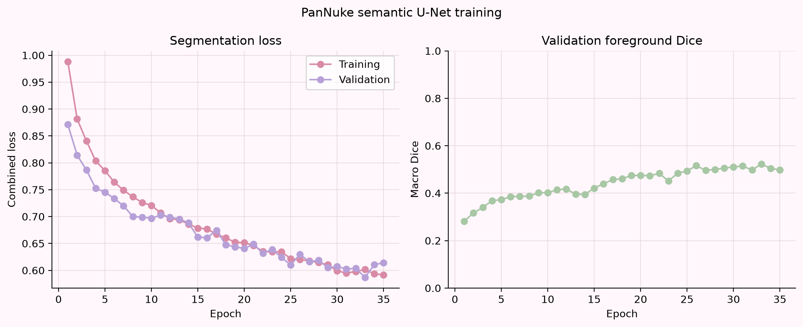
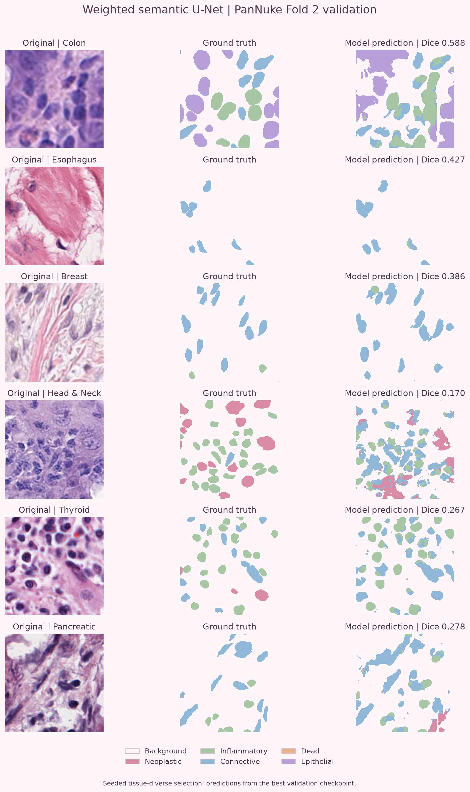
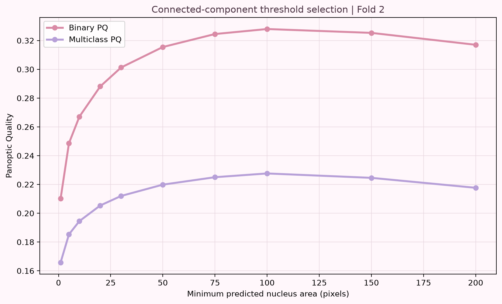
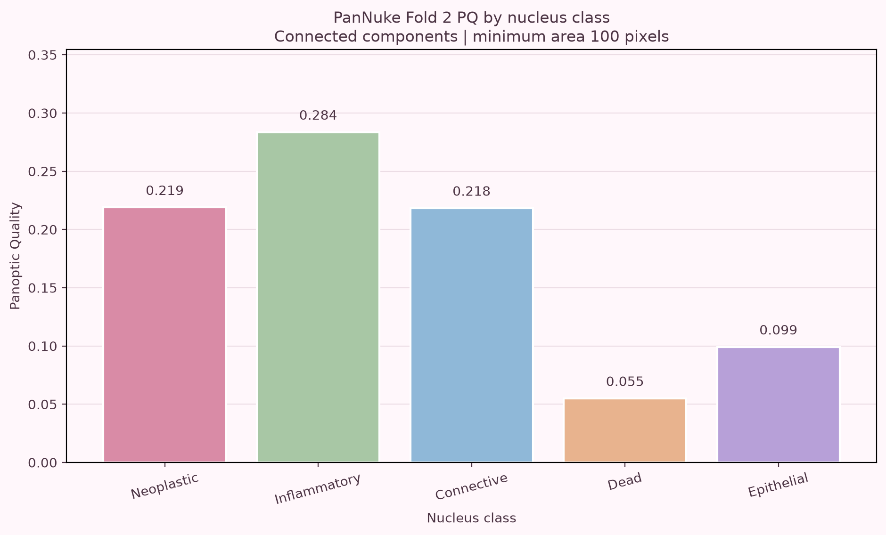
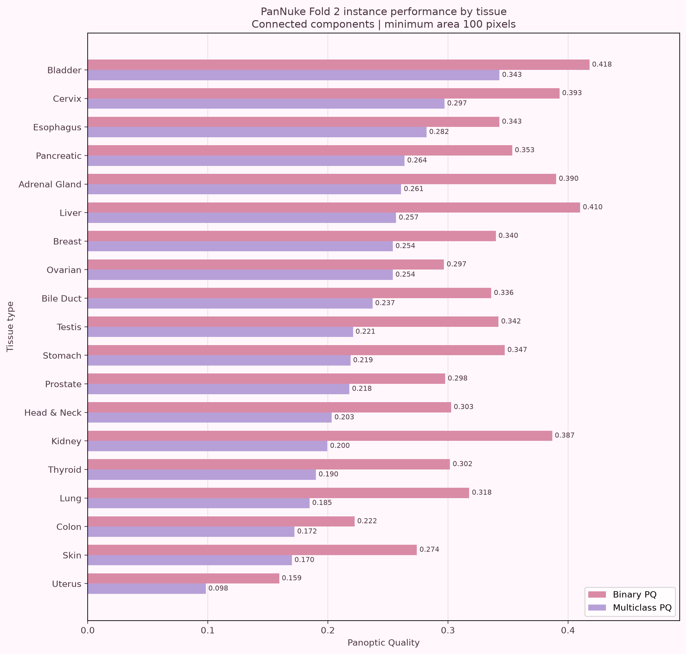
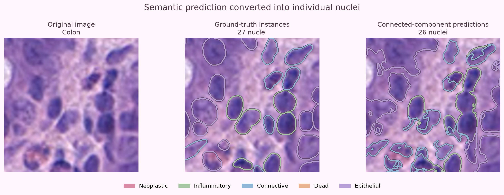

# Semantic U-Net baseline

## Overview

This experiment establishes a reproducible semantic-to-instance nucleus
segmentation baseline on the PanNuke dataset.

The pipeline consists of:

1. A compact multiclass U-Net.
2. Class-balanced semantic-segmentation training.
3. Connected-component instance reconstruction.
4. Validation-based minimum-area selection.
5. Binary and multiclass Panoptic Quality evaluation.

## Experimental protocol

| Component | Setting |
|---|---|
| Training split | PanNuke Fold 1 |
| Validation split | PanNuke Fold 2 |
| Locked test split | PanNuke Fold 3 |
| Input size | 256 × 256 pixels |
| Semantic classes | Background + five nucleus classes |
| Architecture | Compact U-Net |
| Base channels | 32 |
| Batch size | 4 |
| Training epochs | 35 |
| Best epoch | 33 |
| Loss | Class-balanced cross-entropy + multiclass Dice |
| Instance reconstruction | Class-wise connected components |
| PQ matching threshold | IoU > 0.5 |
| Selected minimum area | 100 pixels |

Fold 3 was not used for model selection, threshold tuning, or qualitative
sample selection.

## Semantic-segmentation results

The best checkpoint occurred at epoch 33.

| Metric | Fold 2 result |
|---|---:|
| Macro foreground Dice | 0.5228 |
| Pixel accuracy | 0.8762 |
| Background Dice | 0.9427 |
| Neoplastic Dice | 0.6780 |
| Inflammatory Dice | 0.5861 |
| Connective Dice | 0.4909 |
| Dead Dice | 0.2479 |
| Epithelial Dice | 0.6110 |

## Instance post-processing

Semantic predictions were converted into individual nuclei using
eight-connected components independently for each predicted nucleus class.

Small predicted objects were removed using a minimum-area threshold selected
on Fold 2. The threshold-selection rule was:

> Choose the minimum area with the highest Fold 2 multiclass PQ, using binary
> PQ to break a tie.

The selected threshold was 100 pixels.

## Instance-segmentation results

| Metric | Fold 2 result |
|---|---:|
| Binary Panoptic Quality (bPQ) | 0.3280 |
| Multiclass Panoptic Quality (mPQ) | 0.2276 |
| Matched nuclei | 22,620 |
| Extra predicted nuclei | 23,909 |
| Missed nuclei | 37,252 |

### Performance by nucleus class

| Nucleus class | PQ |
|---|---:|
| Neoplastic | 0.2189 |
| Inflammatory | 0.2836 |
| Connective | 0.2183 |
| Dead | 0.0550 |
| Epithelial | 0.0991 |

### Performance by tissue

The strongest multiclass PQ was observed for bladder tissue, while the
weakest was observed for uterus tissue. Performance varied substantially
between the 19 tissue types, demonstrating the difficulty of building a
single pan-cancer model that generalizes equally across tissue domains.

## Interpretation

The semantic model learns meaningful nucleus-class regions, but semantic Dice
does not directly translate into strong instance segmentation.

The connected-component baseline has three important limitations:

1. Touching same-class nuclei can merge into one predicted instance.
2. Irregular semantic regions can fragment into multiple false instances.
3. Rare classes, particularly dead nuclei, remain difficult to learn and
   evaluate reliably.

Increasing the minimum-area threshold removes many tiny false detections, but
it cannot separate merged nuclei or repair inaccurate boundaries.

## Conclusion

This experiment provides a complete and reproducible E1 baseline:

> H&E image → semantic U-Net → class map → connected components → bPQ/mPQ

Its limitations motivate the next experiment: a boundary-aware model followed
by watershed instance reconstruction. That method will explicitly learn
nucleus boundaries and attempt to separate touching nuclei.

## Reproducibility notes

The dataset mirror was pinned to revision:

`1f498f7bd6a85ef5f204c592b41ac881eab61005`

The best local checkpoint is:

`models/checkpoints/semantic_unet_weighted_best.pt`

Model checkpoints are excluded from Git because of their size. Training
configuration, metrics, tests, and generated figures are version controlled.

## Dataset and metric references

- [PanNuke Dataset Extension, Insights and Baselines](https://arxiv.org/abs/2003.10778)
- [Official PanNuke evaluation metrics](https://github.com/TissueImageAnalytics/PanNuke-metrics)

PanNuke data remain subject to the dataset's CC BY-NC-SA 4.0 license.
The repository's MIT license applies to project code and does not override the
dataset license.